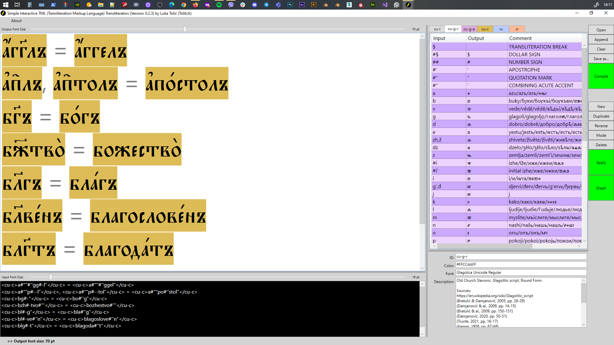

# Simple Interactive TML (Transliteration Markup Language) Transliterators

## [1] Introduction

Welcome! For a quick introduction on the _TML Transliterators_, check [my dedicated YouTube channel](https://www.youtube.com/channel/UC3f1I01uUfvizAAtGOI-FYQ) with videos about my two transliterators (there was an older version of this transliterator, developed in Python 2.7 between 2014 and 2017: [Personal Scintilla-Based Transliterator](https://github.com/lukatolitch/stc-transliterator)).

Few screenshots:





I’ve recently started learning the _Old Church Slavonic_ language (_OCS_), the first literary slavic language. This language is traditionally written in two scripts, _Glagolitic_ (round, angular, and cursive) and _Cyrillic_. Linguists (and other specialists) also use special subsets of the _Latin_ script to transliterate the _OCS_ for various study purposes. I therefore needed a simple and practical personal transliterator to transliterate between these three scripts and help me in my learning process. Since I wasn’t able to find a suitable online or desktop solution for this task, I’ve started developing this here Windows desktop application in _C#_ (.Net 6.0), using _WPF_ (_Windows Presentation Foundation_) to build the GUI.

To meet the need of using multiple transliteration segments in a single text, I’ve developed the ‘_TML_’ or ‘_Transliterator Markup Language_’ transliterators. The idea is to use a very simple markup in the input text to delimit parts of text that transliterate into specific target scripts. Each _TML_ transliterator is defined by the transliteration rules out of which then the working transliterator is compiled. One can have a virtually unlimited number of such transliterators to apply on the input text using the markup. A _TML_ transliterator is implemented as a ‘_pseudo finite-state transducer_’ (a somewhat simplified finite-state technology). The _TML_ transliterators do not use any parsing heuristics, lexical databases, machine learning or AI: they are just a simplified version of the old finite-state transducer techologies and behave in a predictable and rather mechanical way. (See more about the mechanics of transliteration with the _TML_ transliterators below.)

The current version of the app is **0.2.3**. When it reaches version **1.0**, I’ll create an installer and distribute it. Until then, here’s the source code. Nota bene that I’m not a professional developer myself and I’m looking for collaborators to complete this idea, so if you’re interested to help me, please feel free to contact me!

## [2] Transliteration Mechanics

### [2.1] Transliteration Rules

To create a _TML_ transliterator, one first has to specify the transliteration rules, from which a _TML_ transliterator is then constructed automatically. The easiest way to specify these rules is to use the app's GUI to enter the transliteration input/output pairs directly into the table (or into the text box, if the input mode has been changed). For example, let's write transliteration rules for a subset of the Russian language, where the input strings are in Latin script and target strings are in Russian Cyrillic script:


These six transliteration rules from transliteration input (or source) string(s) to the transliteration output (or target) string(s) define a _TML_ transliterator: (**h→х**), (**c→ц**), (**ch→ч**), (**s→с**), (**sh→ш**), and (**shch,shh→щ**). Here ‘**x→y**’ means ‘_x transliterates to y_’ and ‘**x,y→z**’ means ‘_both x and y transliterate to z_’. Other possibilities (not used here) are ‘**x→y,z**’, which means ‘_x transliterates to y_’ (_y_ is the first, or the ‘preferred’ transliteration output variant), and ‘**x,y→z,w**’, which means ‘_both x and y transliterate to z_’. The last two cases demonstrate that the _TML_ transliterators (in the current version) are deterministic: even in case of more than one output strings, each of the input strings in a transliteration rule is always transliterated as the first (or 'preferred') output string.

Such transliteration rules, that define a _TML_ transliterator or a collection of _TML_ transliterators, can also be loaded from a special _XML_ file. For example, here's the _XML_ version of the above transliterator:

```
<?xml version="1.0" encoding="utf-8"?>
<transliterators>
  <transliterator id="t" color="#FFDDDDDD" font_family="Times New Roman" description="A transliteration table for testing the transliteration algorithm.">
    <map comment="">
      <input>h</input>
      <output>х</output>
    </map>
    <map comment="">
      <input>c</input>
      <output>ц</output>
    </map>
    <map comment="">
      <input>ch</input>
      <output>ч</output>
    </map>
    <map comment="">
      <input>s</input>
      <output>с</output>
    </map>
    <map comment="">
      <input>sh</input>
      <output>ш</output>
    </map>
    <map comment="">
      <input>shch,shh</input>
      <output>щ</output>
    </map>
  </transliterator>
</transliterators>
```

Another option is to create a suitable transliteration table (with the three - '_Input_', '_Output_', and optional '_Comments_' - columns) in Google Sheets, and then to copy-paste them in the _TML_ transliterators app's GUI (while a transliteration table is in its edit mode - use the '_Mode_' button on the right side of the app's GUI).

Of course, the real-life sets of transliteration rules will usually be much more complex! For example, here are my Latin, Glagolitic, and Cyrillic transliteration rules for the _OCS_ (Old Church Slavonic) language. Each of this sets of transliteration rules defines a _TML_ transliterator that will be used to transliterate a corresponding marked-up segment of the input text:


### [2.2] Transliterator Construction

Now that the input (the transliteration rules) has been specified, on clicking the ‘Compile’ button the app will automatically generate the _TML_ transliterators that transliterate the corresponding marked input text. The construction of the _TML_ transliterators proceeds in three steps:(1) first, from the each set of input transliteration rules a normalized transliteration map is constructed; (2) then, from these transliteration maps transliteration trees are constructed; and (3) finally, from these transliteration trees transliteration tables are constructed, which do the actual transliteration.


#### [2.2.1] Transliteration Map

The first step in the construction of the _TML_ transliterator from the above six simple transliteration rules is to construct the ‘_transliteration map_’, that is a set of  normalized transliteration rules. ‘_Normalized_’ here means that the algorithm will read the input, and for each entry generate its lowercase, titlecase, uppercase, and ‘doublecase’ variants. This means that all you need to specify in the input transliteration rules are, for example, the lowercase strings, and then the algorithm will normalize them as just described. For the above six transliteration rules we thus get the following transliteration map:


#### [2.2.2] Transliteration Tree

The next step in the construction of the _TML_ transliterator is to parse the transliteration map entries from the previous step and to construct a transliteration tree-like data structure, where the input strings are analyzed and hierarchically organized as successive nested semi-derivative transliterations. For example, from the above transliteration map we get this '_transliteration tree_':


#### [2.2.3] Transliteration Table

The final step in the construction of the _TML_ transliterator from the input transliteration rules is to convert the _transliteration tree_ (see the previous step) into a '_transliteration table_'. This transliteration table is used for the actual transliteration of the input text. It’s something like the transition table used in programming finite-state automata, but it also mimics the behavior of a finite-state transducer (with input and output tracks). From the transliteration tree constructed in the previous step, we get the following transliteration table, a sparse matrix where for each input state and input string we have the output string, the _IsFinal_ value, and the number of the next state defined:


#### [2.2.4] Transliteration Graph

The transliteration table can be converted to a graph: there’s functionality in the app to convert a transliteration table to a graph in the _.graphml_ format. It can be opened and inspected in the free graph manipulation app [yEd Graph Editor](https://www.yworks.com/products/yed) from yWorks. For example, for the above transliteration table we get this graph:


# [3] TUTORIAL

To do! I yet have to write the tutorial. If there'll be enough requests, I'll create a video tutorial. For the moment, you can see the _TML_ transliterators in action on [my YouTube channel](https://www.youtube.com/channel/UC3f1I01uUfvizAAtGOI-FYQ).

# [4] FONTS

Fonts, used to display the scripts, are not included in the app! They have to be downloaded and installed on your Windows in order to render the transliterated segments correctly. Here are the ones I use and recommend:

[1] Extended Latin script - "[Noto Sans](https://fonts.google.com/noto/specimen/Noto+Sans)" by Google. 

[2] Glagolitic script, round form - “[Glagolica Unicode](https://nomail.com.ua/family/Glagolica%20Unicode)” by Emil Heršak.

[3] Glagolitic script, angular form - “[Glagolica Missal DPG](https://www.nenad.bplaced.net/doku.php/hr:glagolmissal)” by Nenad Hančić-Matejić.

[4] Old Church Slavonic Cyrillic script - “[Pochaevsk Unicode](https://www.azfonts.net/fonts/pochaevsk-caps/regular-310476)” by Vladislav V. Dorosh.

[5] Serbian Cyrillic script - “[Resavska BG Sans](https://www.tipometar.org/aktuelno/akcija!/ResavskaBG/Index.html)” by Olivera Stojadinović.

[6] Russian Cyrillic script - "[Gentium Book Plus](https://fonts.google.com/specimen/Gentium+Book+Plus)" by SIL International.

# [5] SOURCES

## [5.1] PROGRAMMING

These are the books I've used to teach myself programming a transducer in C#:

[1] [Albahari, J., Albahari, B. (2017) C# 7.0 in a Nutshell. The Definitive Reference. O’Reilly, Boston, USA.](https://www.amazon.com/C-7-0-Nutshell-Definitive-Reference/dp/1491987650/)

[2] [Cormen, Th. H., Leiserson, Ch. E., Rivest, R. L., Stein, C. (2009) Introduction to Algorithms. Third Edition. The MIT Press, Cambridge, Massachusetts, USA. Pp. 995-1002](https://www.amazon.com/Introduction-Algorithms-fourth-Thomas-Cormen-ebook/dp/B094WZNKP2/)

[3] [Mihov, S., Schulz, K. U. (2019) Finite-State Technique. Automata, Transducers and Bimachines. Cambridge University Press, Cambridge, UK. Pp. 72-137.](https://www.amazon.com/Finite-State-Techniques-Transducers-Bimachines-Theoretical-ebook/dp/B07TBMFLVN/)

## [5.2] SLAVISTICS

These are the books I've consulted in constructing my _OCS_ transliteration rules:

[4] Bratulić, J., Damjanović, S. (2005) Hrvatska pisana kultura. Izbor djela pisanih latinicom, glagoljicom i ćirilicom od VIII. do XXI stoljeća. 1. svezak: VIII.-XVII. stoljeće. Veda, Križevci, Croatia. Pp. 28-29.

[5] Damjanović, S. & al. (2009) Povijest hrvatskoga jezika. 1. knjiga: srednji vijek. Croatica, Zagreb, Croatia. Pp. 14-15.

[6] Damjanović, S. (2020) Slovo iskona. Staroslavenska/Staohrvatska čitanka. Peto izdanje. Matica hrvatska, Zagreb. Pp. 50-51.

[7] Trunte, N. (Pandžić, Z., transl.) (2021) Staroslavenska riječ. Gramatika starocrkvenoslavenskoga jezika. Staroslavenski tekstovi. Staroslavensko nasljeđe u Hrvata. Alfa, Zagreb, Croatia. Pp. 16-17.

[8] Hamm, J. (1958) Staroslavenska gramatika. Školska knjiga, Zagreb, Croatia. Pp. 67-68.

[9] Николић, С. (1988) Старословенски језик II. Примери са речником. VII издање. Научна књига, Београд, Србија. Стр. 26-27.

[10] Войлова, К. А. (2018) Старославянский язык. Учебник и практикум. 3-е издание. Юрайт, Москва, РФ. Сс. 35-37.

[11] Буцких, Н. В. (2020) Церковнославяский язык древнерусских памятников XI-XVIII вв. "Зело", Санкт-Петербург, РФ. С. 8.

[12] [Krause, T. B., Slocum, J. (2023) The Sound System. In: Old Church Slavonic Online, The University of Texas at Austin (Accessed: 2023-09-17)](https://lrc.la.utexas.edu/eieol/ocsol)

[13] Karaman, M. (2005/1739) Bukvar. Ex Libris, Split, Croatia. Pp. 4-7.
